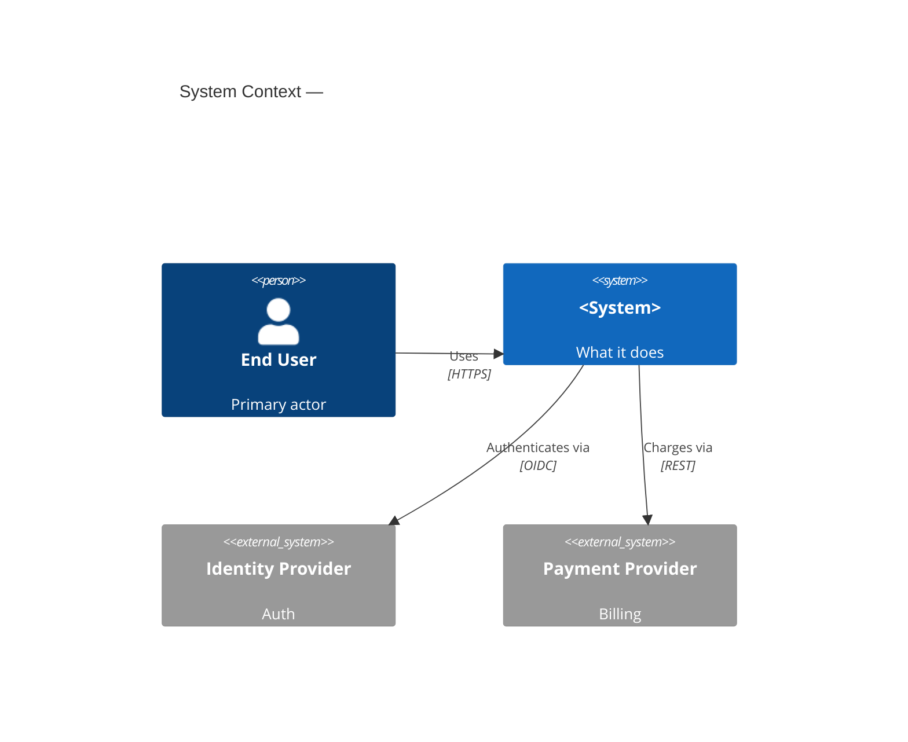
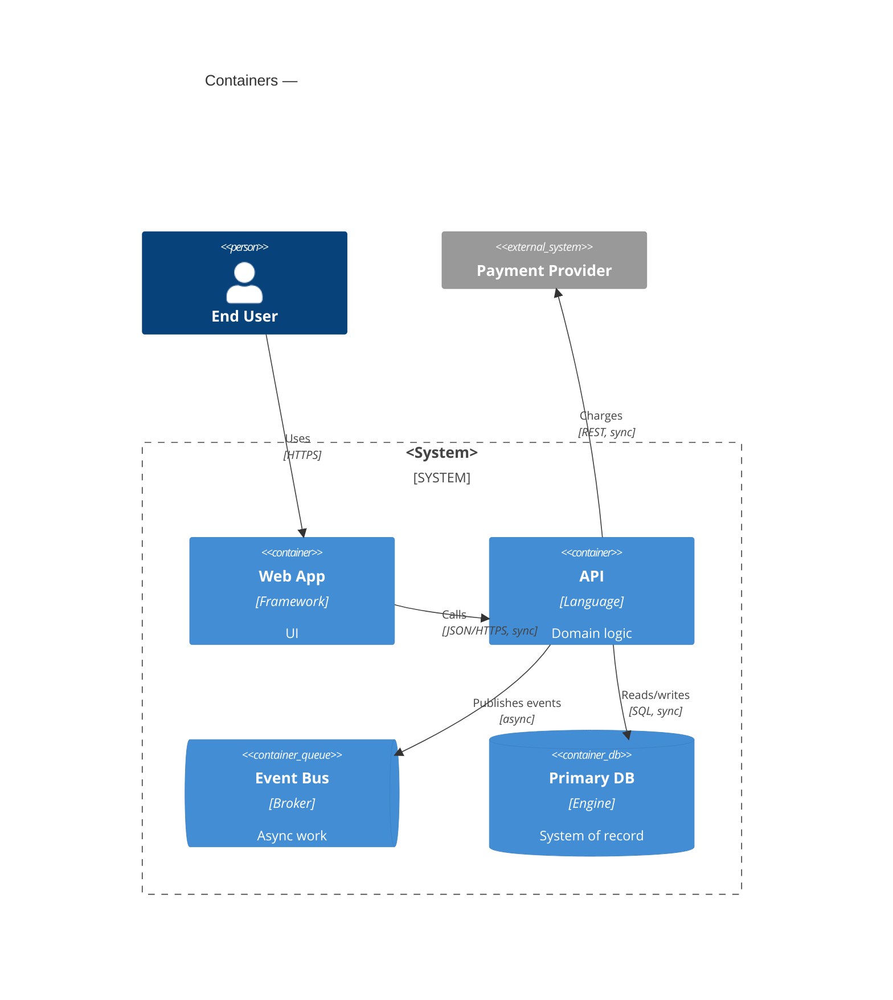
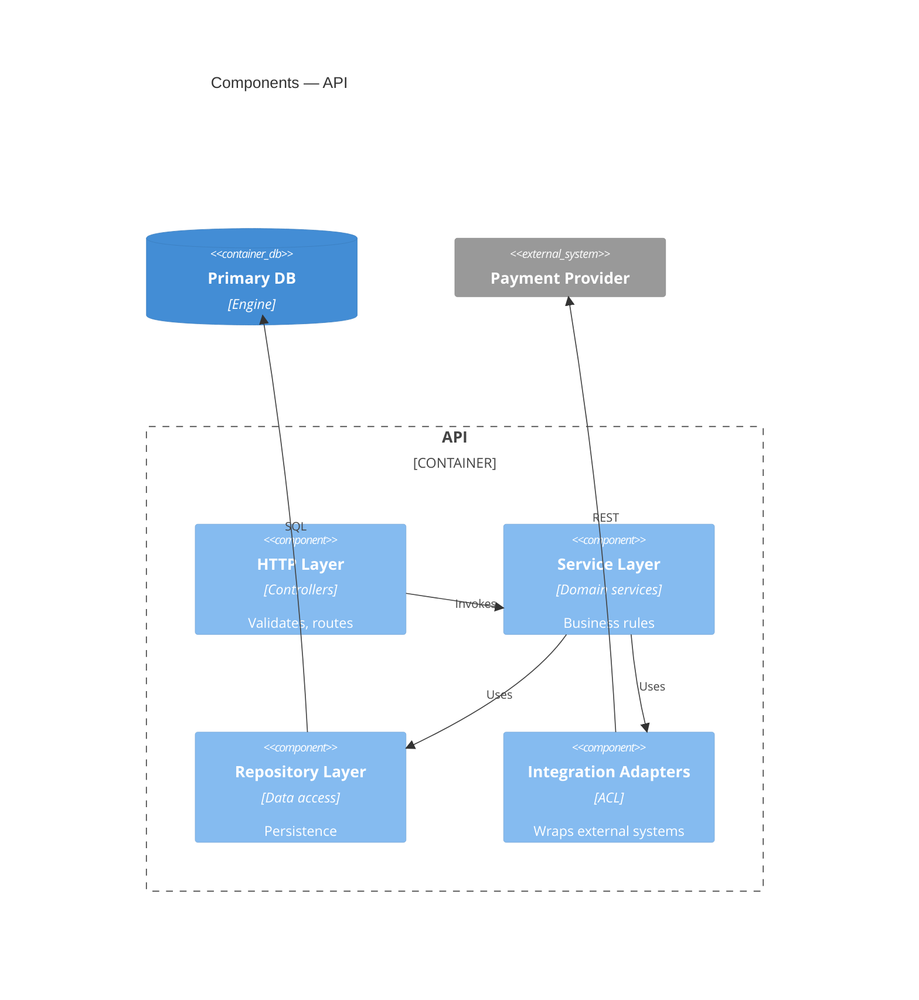
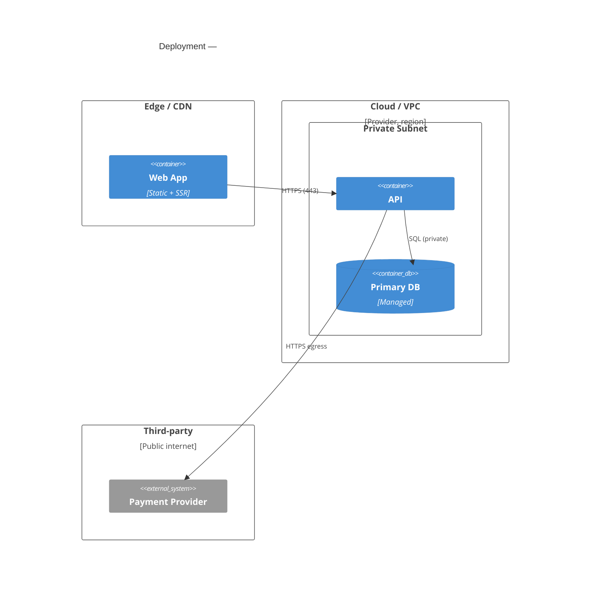

Discuss and document the architecture of the current project using the **C4 model**.

## Principles
- **Discuss before documenting.** Read the code and confirm understanding with the
  operator before writing any files.
- **Verify, never invent.** Every component, integration, and flow must trace to real
  code/config or an explicit operator statement. Mark unconfirmed items `// ASSUMPTION:`.
- **Diagrams are the spine, prose is the detail.** Use Mermaid (text, diffable).
- **Right altitude.** L1 + L2 always. L3 only for complex/critical containers.

## Process
1. **Discover** — read entry points, build/deploy config, dependency manifests, env/IaC,
   CI, service boundaries. Identify actors, the system, external systems, runtime
   containers, and deployment topology. List open questions.
2. **Confirm** with the operator; resolve ambiguity before drawing.
3. **Map domains** — bounded contexts, ownership, what each exposes, isolation mechanism.
4. **Map integrations & data flows.**
5. **Draft diagrams** (templates below).
6. **Review, then write** to `docs/architecture/`.

## Output structure (`docs/architecture/`)
- `README.md` — index, overview, last-reviewed date + commit
- `01-context.md` — C4 L1 System Context
- `02-containers.md` — C4 L2 Containers + data-flow narrative
- `03-components/<container>.md` — C4 L3, only where warranted
- `04-deployment.md` — network/deployment diagram
- `integrations.md` — integrations register
- `domains.md` — bounded contexts & isolation rules

If architecture docs already exist, **update in place** and reconcile differences.

## Mermaid templates
> C4 Mermaid is experimental; fall back to `flowchart` with the same boundaries if a
> renderer lacks support.

### L1 — System Context (always)

### L2 — Containers (always; annotate protocol + sync/async)

### L3 — Components (conditional; shows service-layer separation)

### Deployment / network (always)

## Integrations register (`integrations.md`)
One row per external system — capture **failure mode**, the part teams forget.

| Integration | Direction | Protocol | Auth | Data exchanged | Sync/Async | Failure mode / fallback | Owner |
|---|---|---|---|---|---|---|---|

## Data flow (`02-containers.md`)
For each key flow (auth, primary write, primary read, each integration round-trip):
trigger → path across containers → transformations → persistence → sync/async → error
handling. Use `sequenceDiagram` or `C4Dynamic` for the 2–4 most important flows.

## Domain isolation (`domains.md`)
| Domain / Context | Owning container | Owns (data/entities) | Exposes (API/events) | Depends on | Isolation mechanism |
|---|---|---|---|---|---|

Also state explicitly: the **dependency rule** (allowed direction), **anti-corruption
layers**, any **shared kernel** (and why), and current **boundary violations / debt**.

## When to go to Level 3
Draw L3 for a container only if: it's the most complex/critical container; it has
non-obvious internal layering worth enforcing; or new contributors keep getting its
structure wrong. Otherwise stop at L2.

## Maintenance
Update these docs in the same PR that changes architecture. Record last-reviewed date and
the commit they reflect in `README.md`. Keep diagrams in Mermaid so they diff in review.
