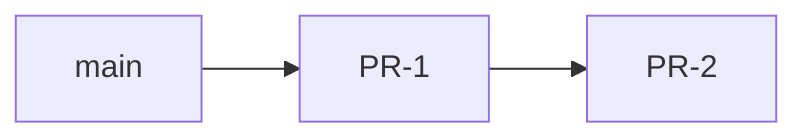

Repeatable workflow for assessing a codebase against **Domain-Driven Design** and
**OO principles**, then producing an actionable alignment plan. Optimised for
client apps (game/UI + pure domain) and layered backends; adapt folder names to
the project.

**Companion commands:** `/plan-feature` (initial plan), `/decompose` (stacked PRs).

**Relationship to other reviews:** `/enterprise-review` audits a *change* (diff-scoped,
advisory verdicts); this command assesses the *whole codebase* and produces a migration
plan. `/document-architecture` documents what exists (C4); this command plans what should
change.

## When to use

- User asks for DDD assessment, bounded contexts, domain isolation, or OO structure review.
- Before a large refactor: need target folders, import rules, and phased migration.
- After `/discover` when the goal is **structure**, not feature behaviour.

**Do not use for:** C4 deployment docs (`/document-architecture`), security review, or
implementing the refactor (switch to the build workflow after the operator confirms the
plan).

## Modes

| Mode | Trigger | Output |
|------|---------|--------|
| **Review only** | "assess", "review", plan mode active | Assessment + recommendations (no `plan/` file unless asked) |
| **Plan** | "create a plan", `/plan-feature` | `plan/<slug>.md` with phases |
| **Decompose** | `/decompose`, "split into PRs" | Stacked PRs section in the plan file |

Default: if the user liked a prior review, offer **Plan** then **Decompose**.

## Workflow

### Step 1 — Parallel discovery (read-only)

Launch **2–3 explore subagents** (or equivalent searches) in parallel:

1. **Domain / service layer** — folder tree, modules, entities vs anemic data, cross-deps,
   god modules, tests, existing `docs/architecture/`.
2. **Presentation / UI layer** — how UI calls domain, rule leakage, god scenes/controllers,
   reverse imports (domain → UI).
3. **Project shell** — top-level layout, scripts, persistence, build-time vs runtime code.

Gather: file trees, import direction, largest files (LOC), boundary violations, documented
trade-offs (e.g. functional engine vs OOP).

### Step 2 — Map to DDD tactical patterns

Fill a table (do not force OOP where the project chose functional style):

| Concept | Where in code | Assessment |
|---------|---------------|------------|
| Bounded context | folders / packages | |
| Shared kernel | types, constants, math | |
| Aggregate root | main state object | anemic vs rich — **note if intentional** |
| Entities / value objects | | |
| Domain services | pure functions / classes | |
| Application services | facades, use-case APIs | |
| Anti-corruption layer | adapters (storage, external APIs) | |
| Repository | persistence boundary | |

**Verdict line:** state whether the project is "missing DDD" or "DDD with functional/anemic style."

### Step 3 — OO principles pass

| Principle | Finding | Severity |
|-----------|---------|----------|
| Single Responsibility | god modules / scenes | |
| Dependency Inversion | domain imports UI/framework | |
| Interface segregation | wide imports from consumers | |
| Open/Closed | extension points (AI, plugins) | |

List **classes vs functions** honestly. Phaser/React/Vue controllers as OOP presentation is fine.

### Step 4 — Boundary violations inventory

Classify each issue:

- **Critical** — domain → presentation/framework imports, duplicated domain rules in UI.
- **Medium** — presentation helpers in domain, infrastructure in domain, god files.
- **Low** — missing lint rules, deprecated shims, stale docs.

Cite **file paths** and line-level examples where possible.

### Step 5 — Target structure (preserve what works)

Propose folders + **import rules** (one diagram + one tree). Principles:

- **Do not** recommend full OOP rewrite unless user explicitly wants it.
- **Do** recommend: subdomain folders, `application/` facades, `infrastructure/` ACL,
  presentation decomposition, barrel `index.ts` namespacing.
- **Defer:** event bus, CQRS, rich aggregate classes unless there's a triggering requirement.

Include mermaid `flowchart` for contexts and dependency direction.

### Step 6 — OO patterns to adopt (lightweight)

Pick from this menu only what fits:

| Pattern | Use when |
|---------|----------|
| Application facade (`turnApi`, `*UseCases`) | UI imports too many domain modules |
| Repository const / port | persistence scattered in domain |
| Strategy | AI, plugins, interchangeable algorithms |
| ViewModel | display logic mixed in scenes/components |
| Composition (controllers) | god scene/component > ~400 LOC |
| Value-object factories | invariant guards without classes |

Include **"What not to do"** (3–5 bullets) to prevent over-engineering.

### Step 7 — Risk-first phases

Order work: **contracts → domain structure → application layer → persistence →
presentation → UI decomposition → docs/polish**.

Add **operator gate** after the riskiest early PR (usually boundary fix + first split).

### Step 8 — Write plan file

If the user wants a plan, write `plan/<slug>.md` using the **plan file template** below.

- **Slug:** kebab-case from feature name (e.g. `ddd-architecture-alignment`).
- Update `CLAUDE.md` **Current work** table (Feature, Plan, Status).
- Status: `Not started` → `Decomposed — awaiting operator confirmation` after `/decompose`.

### Step 9 — Decompose stacked PRs

When asked, expand **§ Stacked PRs** per the **stacked-PR template** below:

- Each PR **< ~1,000 lines**, one concern, stacks on previous branch.
- Per PR: title, branch, stacks-on, scope, anti-scope, estimated size, acceptance criteria
  (specific test files + test/typecheck/build commands + manual checks).
- Order: foundational → persistence → UI → polish.
- **Do not build** until operator confirms the split.

## Quality bar

- Ground claims in the repo (read files, grep imports); flag uncertainty.
- Respect documented trade-offs in `docs/architecture/` — don't fight intentional choices.
- Minimum sufficient refactor: move/re-export, don't reimplement rules.
- Align with repo standards: `AGENTS.md`, `.cursor/rules/standards.mdc`, domain rules if present.
- Plans proportional to scope — no 50-page enterprise DDD textbook.

## Handoff to implementation

After operator confirms decomposition:

1. Follow the repo's standards and `AGENTS.md` (test-first, pause per task, commit on approval).
2. One stacked PR at a time; branch name from plan.
3. Run per-PR verification commands from the plan.
4. Update `docs/architecture/domains.md` (or equivalent) in the final PR.

## Plan file template

Copy into `plan/<feature-slug>.md` and fill placeholders.

~~~markdown
# Plan — <Title>

**Feature slug:** `<kebab-slug>`
**Status:** Not started | Decomposed — **awaiting operator confirmation before build**
**Owner:** TBD
**Base branch:** `main` (or the repo default)

---

## 1. Goal & constraints

### What we want
1. …

### What we are not doing
- …

### Constraints
- From `AGENTS.md`, standards, domain rules
- Stacked PRs < ~1,000 lines; behaviour unchanged unless stated

### Success criteria (feature complete)
- [ ] …
- [ ] Test suite, typecheck, and build green

---

## 2. Assessment — current state

### What is working
| Area | Evidence |

### Gaps to close
| Issue | Location | Severity |

### DDD mapping (tactical)
| Concept | Today | Target |

---

## 3. Target architecture

<mermaid flowchart — contexts and dependency direction>

### Target folder layout
<code tree>

### Import rules
<text diagram>

### Namespacing
- folder + barrel `index.ts`
- optional path aliases

---

## 4. OO patterns to adopt

| Pattern | Where | Purpose |

### Explicitly deferred
- …

---

## 5. Risk-first ordering

| Order | Risk | What to prove |

**Operator gate:** pause after PR-N — …

---

## 6. Phases

### Phase 0 — …
**Deliverables** / **Milestone**

(repeat per phase)

---

## 7. Stacked PRs

> Decomposition complete. Do not build until operator confirms.

### Stack overview
| PR | Branch | Stacks on | Concern | Est. lines |

(per-PR sections — see the stacked-PR template)

---

## 8. Priority matrix

| Change | DDD value | Effort | Risk | When |

---

## 9. Open decisions

| # | Question | Options | Recommendation |

---

## 10. Relevant files

### Domain | Presentation | Docs | Tests

---

## 11. Manual test plan

After each PR: …

---

## 12. Bottom line

One paragraph: preserve what works; structural improvements only.
~~~

## Stacked-PR template

Paste into plan **§7 Stacked PRs** after `/decompose`.

~~~markdown
## 7. Stacked PRs

> **Decomposition complete.** … **Do not start building until the operator confirms this split.**

### Stack overview

| PR | Branch | Stacks on | Concern | Est. lines |
|----|--------|-----------|---------|------------|
| PR-1 | `refactor/<slug>-01-…` | `main` | … | ~N |

**Operator gate:** pause after PR-N — …



---

### PR-N — <short name>

| Field | Value |
|-------|-------|
| **Title** | `refactor(<scope>): …` |
| **Branch** | `refactor/<slug>-NN-…` |
| **Stacks on** | `refactor/<slug>-…` or `main` |
| **Maps to** | Phase N |
| **Estimated size** | ~N lines |

**Scope**
- bullet list of files/modules

**Anti-scope**
- what this PR must not touch

**Acceptance criteria**
- [ ] Test suite green — especially: `path/to/*.test.ts`
- [ ] Typecheck clean (e.g. `npx tsc --noEmit`)
- [ ] Build succeeds
- [ ] `rg "<boundary-pattern>" <path>` returns zero (if applicable)
- [ ] Manual: …

---

### Optional follow-ups

| PR | Title | Maps to | Est. |

### Per-PR verification commands

```bash
npm test
npx tsc --noEmit
npm run build
```

| PR | Extra command |
|----|---------------|
| PR-1 | `rg "forbidden-import" src/domain` |
~~~

### Decomposition rules

1. **Order:** contracts → domain structure → application → persistence → presentation → UI split → docs.
2. **Size:** target < 1,000 lines per PR; split import-only churn from logic splits if needed.
3. **Coherence:** one concern per PR (boundary fix, one subdomain split, one facade, etc.).
4. **Shims:** allow temporary re-export shims for one PR only; remove in the following PR.
5. **Tests move with code** — update paths in the same PR as the move.
6. **Gates:** require manual play-through or integration check after high-risk PRs.
